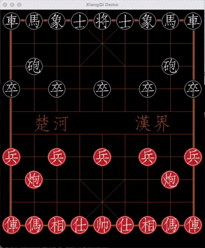

# 中国象棋
这是一个象棋小游戏客户端，开发过程中遵循了面向对象7大设计原则和分层思想。  

## 概述
游戏采用分层的思想设计，包括以下几层：
* 传输层：用来和服务器建立连接，和服务器通信 （待开发...）
* 应用层：游戏操作界面在这一层完成。目前使用的是golang的[ebitengine](https://ebitengine.org/)游戏引擎。 
* 核心层：完成了一个完整的象棋游戏逻辑，和应用层解耦。

## 待优化...
*核心层业务逻辑有些地方不太满意
*游戏界面写的比较赶，缺乏设计

## 待开发...
* 主要是传输层的开发，目前只是完成了单机版，打算后面做成网络对战，包括： 
  * 房间列表
  * 网络对战
  * 对局记录
